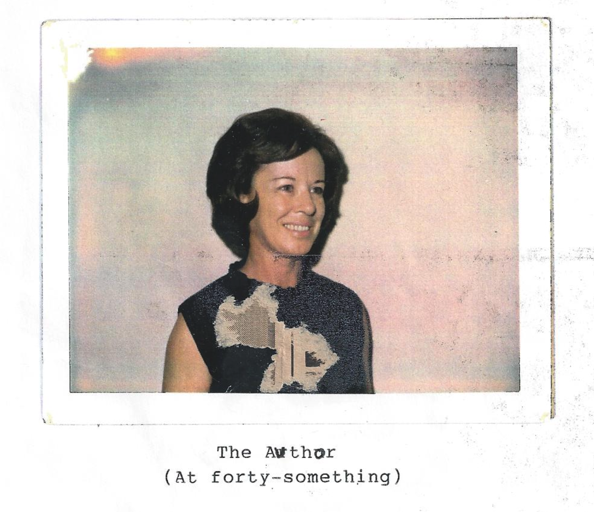

> This is taken from my great aunt Nancy's typewritten memoir. I OCR'ed it so that it is available in text for posterity.

Life began for me on the 2nd day of March, 1923 high on a windy hill (Winchester Hill) at Patterson, Missouri a town of about 350 people in the foothills of the Ozarks.

I was delivered at home by Dr. Jones (as most babies were in those days) the last of four children, a boy and three girls Kenneth being the oldest, then Rowena, Betsy, then last also least, off to a shaky start, yours truly. They were not sure my mother or I either one would live (she had phlebitis which was called milk leg in those days) and I was thin and sickly. However, we both survived to 'kick up our heels' for many years to come.

In those days, highway 34 went through the middle of Patterson. In the middle of town at the foot of two hills was two grocery stores, a feed store and a filling station. One grocery store (Mr. Kline's store) had a long front porch where the loafers and old men sat and chewed tobacco and watched the world go by (especially the young girls!). The filling station (owned by Walter Helems) had a long roof over the gas pumps, and inside besides the usual filling station stuff, was a big rectangular cooler with all kinds of ice cold soda. (Coke in those days was thought to help a headache). On down thru town lived the Beatys, Croys, Wards, Wilkersons, Gills (and more). Peck Croy and his Dad had a filling station and auto repair shop. Inside his station was all kinds of candy, my favorite was some kind of chocolate covered marshmallow goop, round shaped, wrapped in shiny foil. What a treat! I seldom got one, since there wasn't much money for candy. There was a sidewalk from Croy's station past Wards house (long with porch across the front of the house) huge trees growing by the walk with tree roots pushing a hunk of the concrete up.

On the side road, going up Winchester Hill from the middle of town : was Klines house, long gingerbread, post office, formerly a bank, Ralph Elayer's house, he was a rural mail carrier and my best friend's (Dorothy's) father. Their house was formerly a hotel. Past their house and to the right down a little narrow road lived the Adams, Croys (and more). Next came the Baptist Church, cemetery, two room grade school, with a big wood stove and bare oiled floors, then a white frame building where agriculture classes were taught, then the brick high school. Down a little side road from the middle of town, opposite Winchester Hill, was Clarks Creek where we fished and swam and splashed away our childhood.

On this little side road lived the Gustin family with lots of kids. I can still hear Mrs. Gustin yelling, "Cloyd, get them kinds 'outta' the creek!" Meanwhile, back to the middle of town and up the other hill going East from town was the McCormicks, Hovis, Hixsons, Wakefields, Polks and the Keathley's about one half mile from town, where Daddy had bought property from Frank Ward. It had a small weathered house (shack), a spring and a well with a pitcher pump. There was a swampy iarea next to the road we called the frog pond where on a summer's night you could hear the frogs croaking mixed in with the crickets and whippoorwills plus dogs barking in the distance with an owl or two thrown in. (My city cousins used to say it was so quiet in the country, I'm still trying to figure that one out!)

I was three or four years old when we made this move and don't remember much about it. I know there was a lot of people in a small space. Water had to be carried from the spring or well. A bucket of water was kept in the kitchen with a dipper for drinking. Grandpa Keathley was living with us and died around that time. He was laid out in our living room.

Wash day was an all day job. Mom had to carry the clothes to the spring, (with our help, such as it was), build a fire under a wash kettle, boil the clothes, scrub them on-a wash board with a bar of P&G soap, then rinse them in a tub of clean water to which she added liquid bluing from a bottle to whiten them. Starch had to be made by boiling flour and water together. Dresser scarves, dresses, shirts, aprons, lots of things had to be starched, and of course all the water carried from the well or spring. In cold weather, water was boiled on the kitchen stove ina copper wash boiler. Two tubs were put on a bench, one to scrub the clothes in, the other to rinse them. Later on Mom would get a Maytag washing machine run by a gasoline engine and wonder of wonders, it had a ringer on it! Clothes were hung on a clothes line outside and when it was cold the long underwear and overalls would freeze 'til' they could stand alone and had to be dried behind the stove. In the Spring, birds would fly over and leave purple droppings on the sheets from eating mulberries. Much later, Mom had an automatic washing machine (we called it) that washed, rinsed and spun the water out of the clothes. Mom swore, of course, it would never get the clothes clean.

Ironing was another all day job. All the starched clothes were dampened down and rolled into a ball, then rolled in to a towel and put in a basket the night before. On ironing day, several irons were heated on the wood cook stove and a wooden handle was attached to the irons. Later on, Mom had a gas iron that had to be pumped up and lit with a match. She threw it out the door on several occasions, thinking it was going to explode. I guess that's why the tank was so bent.

These were the times when Daddy was getting started in the handle business. Mom and Daddy had lived in St. Louis for a while (where Rowena and Kenneth were born) before moving back to the country. I think they first moved to Lesterville, where Betsy was born. Then, I think they moved to Patterson (Winchester hill, opposite the Hog Eye road, where I was born) and started the handle mill across Clarks Creek from town. Daddy's brothers (all except one) and father before him all had handle mills, his father in DesArc, his brother Ben in Van Buren, his brother Marvin in Dexter, his brother Leland in Marquand, all quiet successful. His youngest brother, William (Uncle Bill) was born with club feet. In those days this was not so easily corrected so he always lived in St Louis close to his work (as a bookkeeper), so he could walk to work. 

The handle mill was moved from across Clarks Creek to the property East of town with the frog pond in back of it and the little house in front of it with the front yard in between. They built the mill long and low with a tin roof and lots of noisy machinery. It was run by a big steam engine fired by the saw dust and shavings and wood from the handles. It . had a dry kil where the handles were dryed and a room where they were varnished and waxed. Water was piped from a well behind the mill to the big boiler. A night watchman (Jasper White) was hired to clean up and keep watch in case a fire started in the roof of the mill from sparks. This happened several times that I can remember. The watchman would blow the whistle in the dead of the night, and Kenneth and Daddy would dash to the mill to put the fire out with a hose connected to the boiler. It seems Kenneth did most of the work since Daddy would be so nervous and upset. This was a scary experience for a little kid. I would hide under the covers thinking the mill was going to burn down.

Around this time the great depression was going on. Lots of people had no job, no money and no home. Men walked and hitch-hiked across the country looking for work. People always picked them up and gave them a ride. (To be attacked >y a hitch-hiker was unheard of). They would come to the house and ask for food. Mom always fed them and they sometimes slept in the mill in tue sawdust or shavings. There were also whole families traveling, some with babies and small children. Mom fed them all, fixing baby bottles, making cerial, cooking food, whatever it took.

There were traveling tent shows that would come to town and set up their tent down by the creek. They had vaudeville acts and Western movies (silent). Also, they sold salve and tonic that was supposed to cure anything and everything. We would pick strawberries and trade them for tickets to the show.

When I was around six or seven years old, Daddy and Grandpa Center built our new house a short distance back from the little shack. Grandpa Center was a carpenter by trade and lived with us the whole time I was growing up. His wife died before I was born. To me this was a grand house! A kitchen with buiit in cupboards, a china cabinet between the kitchen and dining room with glass doors opening into each room. A wood box in the kitchen wall beneath the double windows where wood could be put in from the outside and taken out from the inside. Also, the inside had a wooden lid across the top that we used for a seat with the kitchen table in front of it. Whoever sat there would have to move when someone needed wood. Daddy always brought an arm load of wood when he came from the mill and threw it in the box from the outside.

There was a wide door between the living and dining room and a good sized bed room down stairs where Grandpa and Kenneth slept. The stairs were enclosed between the living room and bedroom. Upstairs was a large and a smaller sized bed room. There were dormer windows in the large room overlooking the front yard, mill and road to town. Bookshelves were built underneath the dormer windows and best of all, closets across the entire front and back of the house upstairs. The roof came down low es over the closets where we loved to play with our dolls. We had doll furniture (that Grandpa made) and doll clothes (that we made). It was especially nice when the rain pattered down on the low roof and we were warm and cozy with our dolls and play things, big little books, Child Life magazines, paper dolls cut out of magazines and catalogs, scrap books etc.

A porch was built across the front of the house with a swing where we would swing and sing and Kenneth would play his guitar and sing, Red River Valley, She'l be Comin Around the Mountain, When the Work's all Done this Fall, My Darling You Can't Love One, etc.

A screened in porch was built across the back with a cistern. The rain water was piped off the roof and thru a filter by the back porch and into the cistern. The water had a different taste, some people didn't like it. We liked to wash our hair in it because it was so soft. Anyhow, no more carrying water! A little later a well was drilled in the back yard and piped into the house.

The brick chimney was built crooked inside the house so it would come out straight at the top. There was no heat at night since the house was heated by two wood stoves, one in the kitchen and one in the living room. The first sounds I heard in the morning was Daddy building a fire in the stoves. I would jump out of bed and run to the warm brick chimney to put my clothes on. The second thing I heard was Mom scraping gravey from the iron skillet. Then I hurried down stairs to a breakfast of biscuits and gravy and eggs. Daddy always had to have oatmeal and Grandpa always had to have mush.

The house was painted yellow (and not a very pale yellow, I must say) which was a popular color in those days. After that, it was always painted white. The walls were built three layers thick, the middle layer of boards slanted. Daddy wired the house with the plugs half way up the wall, so you didn't have to bend over to plug something in I suppose. I guess at the time we were so glad to have electricity no one thought about it. Before electricity came thru that part of the country, Daddy had rigged up a delco for lights and stuff. It made so much noise he wouldn't run it on Sundays.

Daddy was born and grew up in DesArc. He was stocky built with sky blue eyes, thick lips and curly hair (I can only remember him with a little hair around the edges). He had four brothers, which I mentioned before and two sisters, Elma and Etta.

He was very intelligent, building complicated machinery, parts for machinery, manufacturing all kinds of hickory handles, pick, ax, hammer, single trees, etc. He hired six or seven men full time and had hickory logs hauled in by trucks and once in a while a team of horses and wagon. Daddy worked hard all week, doing all the book work on the dining room table after supper. He had an old Oliver typewriter that he did correspondence on by the ‘hunt and peck' method. Later, he had a Royal typewriter, manual of course. They blew the whistle for lunch (everyone in town knew when it was 12:00 o'clock). Daddy would come rushing to the house for dinner (we didn't call it lunch). Sometimes Mom would say, "here comes a Daddy with his head and tail up and tongue out and frothing at the mouth" (I think this must have come from her horse back riding days). We would rush around and get dinner on the table. Then he would rush back to the mill in time to file his saw before the mill started up again. They blew the whistle again at five, quitting time.

Daddy was a workaholic during the week, but on Sunday he never lifted a finger to anything remotely resembling work and was enjoyable to be around. On Sunday morning I would wake up to church music and preaching on the radio. He would be studying his Sunday School lesson and Bible. He was superintendent of Sunday School for a long time (and president of the School Board). We all went to Sunday School as regular as breathing and always in our prettiest dress. All week Daddy wore bib overalls and dirty felt hat, but on Sunday he he wore a suit and tie and his best felt hat. Mom didn't always go to church, she usually stayed home and cooked Sunday dinner. Sometimes Daddy would bring the preacher home for dinner and Mom would never know if he was coming or not. Daddy usually went to church also on Sunday night and to prayer meeting during the week. He was perhaps a fanatic about his Baptist religion in that he was such a strict disciplinarian, especially with Kenneth. He didn't believe in anything habit forming, dancing, gambling, any kind of cards or movies and of course liquor, cigarettes, coffee, etc. Later in life he would loosen up a lot and was a much more approachable person. Kenneth left home at one time because Daddy was so strict with him. No one knew where he was or what he was [P> doing. Maybe the final straw was when Daddy found a playing card in the yard and raised a big ruckus. I don't remember how long Kenneth was gone (he had been in St. Louis) but I know Daddy was really upset and worried about him and after that he mellowed out and was not so strict. We had Kenneth to thank for paving the way for us. Daddy's biggest regret in later years was that he didn't spend more time with Kenneth when he was growing up. This was especially hard for him when Kenneth preceded him in death at the age of 55 from a sudden heart attack.

Sometimes on Sunday we would go to Marquand to Uncle Leland's house. This involved fording a creek and going up a steep hill where he would have to shift gears to get to the top and I was afraid the car was going to roll backwards down the hill. Sometimes we would go to DesArc and he would race trains where the road ran beside the railroad tracks for a few miles. When I was too young to remember, Daddy took us on a trip to Colorado to see Mom's sister (Aunt Jess and Uncle Leo). This must have been quite an undertaking in those days with no paved roads..~He drove a Willys knight touring car with snapped on izenglass windows and running boards. Much later he took us to Florida to see his sister (Aunt Etta and Uncle Frank). We stayed in Tourist Homes and Tourist Cabins on the way down and back. It was our first time to see and swim in the ocean 7 (Daytona Beach).They lived near Ocala and had an orchard. Every Christmas they would send us a crate of fruit, oranges,grapefruit, tangerines and pecans. I didn't know fruit ever grew : so big and delicious. Much, much later I would go with Daddy to the Caribbean on a banana boat, but that's another story. He had an adventuresome spirit. He was also a soft touch for anyone who wanted to borrow money. He had a pocket watch of someone's who he loaned money to. They never paid it back so he was stuck with a cheap watch (Mom said!) He also had a deed on Logan Mountain for a while. We would hike the mountain thinking some day it would belong to us, but since it never came to pass, the loan must have been paid off. About the only hobby Daddy had was fishing. He could sit for hours (it seemed) and wait for a fish to bite. He also planted a big peach and apple orchard on the upper property next to the Hog Eye Road for a hobby. Actually this turned out to be a lot of work. Picking and culling peaches in hot weather with peach fuzz sticking to you was not my idea of a fun hobby!

Mom was average size for those days, delicate features and pretty with long hair braided and penned on top of her head.

She would take her hair down and brush it every night. She took a nap every afternoon and read for a while. She subscribed to a lot of magazines and news papers. She didn't have much of a social life except for church and school activities occasionally. Mom's relatives from Ester and Flat River would sometimes show up on Sunday and spend the day. We didn't have a phone, but they ae would write sometimes and say they were coming. That was her brother Herman who worked in the lead mines, his wife Suzie and kids, Mildred, Mable and Bud. I remember Aunt Suzie and Mom talking and Mom would tell her something and she would say, "Wel-l-l-l-l!" She really drug this word out, util it faded into the distance someplace. ~Of course they came to see Grandpa too and would take him home with them sometimes to visit, not very often. He liked it where he was.

Mom would usually kill a chicken or two (this involved chopping their head off and scalding them so the feathers would come off). She cooked a big Sunday dinner for everyone, then before they left she would go to the chicken house and get eggs and the garden to get stuff for them to take home. How she survived the day I will never know. Then once in a while we would spend Sunday with them in Ester.

Mom grew up around Ester with three brothers, Herman (who I mentioned before), Homer who lived in Sullivan and was an Architect, Grover who was a farmer and one sister, Jess who lived in Colorado for a while then Michigan. The boys were not the most genteel in the world and she picked up some of their sayings like, "mellow as a preacher's poot", and if you dropped a dish cloth they would say, "some old bitch is coming". When Rowena was little she was at a neighbor's house when someone dropped the dish cloth and Rowena announced "some old bitch is coming"!, much to Mom's horror.

Mom would always tell me, "everyone's crazy except you and me and you are a little". She talked about the days when she and her friends rode horses to visit back and forth since cars were few and far between.

Mom made most of her clothes and ours too. Her dresses were made with a straight skirt and shirt waist top and sometimes the collar was large and flat trimmed in lace. In the summer the cloth was batiste, pique, eyelet pique or a pretty pale cotton print that she had ordered from Sears or Montgomery Ward. It was always exciting to get a parcel post package in the mail when she had sent in an order for material for a new dress or curtains or a new pair of shoes or house shoes, socks, panties, slips, whatever. If they didn't have what she ordered they would replace it with something a little more up-scale. I loved it when she baked yeast bread. Part of it was shaped into big fat buns and we ate them right out of the oven while they were hot with lots of butter. Mom had one little jersey cow that gave rich milk with lots of cream to go on our cereal or pie and to cook with. Our favorite way of eating molasses was to spread thick cream on top and run a biscuit around the edge. We always had corn bread and Kenneth liked to crumble it into a glass of butter milk and eat it. Mom made a really good salad dressing by frying bacon and cooking vinegar and eggs in the grease and pouring it over the salad.

When we were growing up we played with the Hovis, Hixsons, Brooks, Elayers, Gills, Gustins, Wards kids.Hound & Hare was a favorite game. We would split up into two sides and one side would take an old catalogue (sears or Montgomery Ward, we never threw anything away) and scatter little pieces of paper as they went along to leave a trail. Sometimes we would go a long distance through the woods and over a big hill, across fields and down country roads. At the end of the trail we would leave the remainder of the catalogue with a rock to hold it down and hide somewhere near. The other group would follow the trail and find us. One time we ended up near the barn at home so I crawled into a big wooden box that the cow feed (bran) was stored in. Everything was real quiet when suddenly I heard a loud sniffing noise around the lid of the box. It was the cow trying to get to the food. Needless to say, I was glad to be found that day. Then there was the huge sawdust pile in back of the mill that we galloped over playing cowboys and Indians and the mill where we played hide and seek. We made play houses in the woods by outlining the rooms with rocks. Broken pieces of plates and glasses were our dishes. We made gravy by mixing water and fine sawdust, pickles were the oblong shapes cut from the ends of handles, round shapes from the handles were cookies and square pieces were bread. We put boards between trees for a grocery store and stacked them with empty pork and bean cans, tomato cans, vanilla bottles, pickle jars, etc.

We could hardly wait for the first warm day of Spring to ae kick off our shoes and go running through the grass. Sometimes we would step in a glob of chicken poop which would squish up between our toes. Pretty gross stuff, but we would wipe it off on the grass and proceed with our ‘Spring fling'.

In the Summer we spent so much time in the creek our hands and feet would wrinkle like a prune and our feet were so tough we didn't even notice the sharp rocks in the bottom of the creek or on the gravel bars. At that time Clarks . Creek was so deep at the bridge on highway 34 that Kenneth and his friends would dive from the top of the bridge. Once when I was swimming across the deep water I panicked and started going under when one of Rowena's friends (Florence Berdett) pulled me out by the seat of my swimming suit. After sitting on the bank for a while I recovered and was ready to swim again. We had a black and white dog named Hoover who would swim with us and pull us through the water while we held on to his tail.

On hot Summer days the chores were done in the morning while it was still cool. By mid-day the sun was beating down and not a leaf was stirring. You could hear the hum of the bees and wasps and all the other little flying critters including grasshoppers jumping all around while you walked through the grass. The cows would stand in the water in the ponds (if they were lucky enough to have one) or lie in the shade of a tree chewing their cud and swatting flies with their tail. At certain times of the year they would eat a weed called ‘dog finnel' which made their milk taste really bad. Or in the $e Spring they would eat wild onion, you can imagine what this tasted like! Meanwhile back to the hot Summer days, we spent a lot of time in the cellar where it was cooler cutting out paper dolls, reading, sewing doll clothes or napping. Sometimes in the evening we would make ice cream and Kenneth or Daddy would get a big hunk of ice and put it in a toe sack and beat it into little pieces. Then we would pack it with salt around the ice cream container in the bucket. Mom would mix the ice cream out of milk, cream, eggs, sugar vanilla and junket tablets for thickening. Then we would take turns turning the handle until it was too stiff to turn. Umm! Good Stuff Summer storms could be very spectacular. First, there was the distant thunder and dark horizon. Before long the thunder would be louder and the thickening clouds would start to boil overhead. You could see and hear the roar of the pouring rain coming across the field toward the house. Then, everything would hit, the wind roaring in the trees and the rain coming down in sheets, the lightening, the thunder claps and sometimes it would turn as dark as night. I would be so scared I wouldn't know which way to turn. Then, before long the thunder would be once again the distance, the sun would break through the clouds, the chickens would gingerly step around looking for worms that washed out of the ground. Birds came out to sing and chatter about the storm. The usually dry low place in the woods would turn into a swollen stream of water falling over tree roots, making whirl pools, moving on through the woods taking sticks and leaves and anything that got in it's way. Now was the time to wade bare foot in the water and float Lass imaginary boats and make dams and dig out glass bottles, pretty rocks and treasures that the water had uncovered. It was after one of these rains that Betsy called me out to the yard to show me a bird's nest. While I was under the tree trying to see the nest, she pulled a limb down and lit it fly, dousing me ina shower of water. I only remember this because she didn't usually pull tricks like this, I guess the devel made her do it!

We used to play a lot of board games in those days including Monopoly and Uncle Wiggley and checkers. We also played dominoes and jacks and jumped rope. Mumble peg was played by putting the tip of a pocket knife blade on top of one hand, holding it with the other hand and flipping it so the blade would stick in the ground. Fishing was a big pass time for us. We used cane poles with a line, hook, bobber and sinker that Grandpa fixed for us. We would go across the field to the creek, walk out on a fallen log and sit there to fish. We usually caught perch and once in a while a cat fish. On the way back we would climb the big maulberry tree and eat berries:. Our dog, Hoover was always along, chasing rabbits. When he caught one, we made him turn it loose until eventually he would automatically turn them loose when they squealed. Mom taught Hoover to keep the chickens out of the yard by shooing them away and encouraging him to chase them. He came to consider this his job and as soon as a chicken came close to the house he chased it away, then pranced back, . real proud of himself. Of course he got lots of hugs and praise and then he would lie down to finish his nap. Occasionally a copperhead would make the mistake of slithering into the yard. Then we would hear Hoover frantically barking, circling the coiled snake, bobbing in and out while the snake tried to strike him. When he was finally able to grab him in just the right place (just behind the head) he would shake him until he was dead. We were so scared he would get bit but I don't think he ever did.

One of our favorite things to do was to visit Glenda Cobb who lived across the hill from us, and ride horses. To get there, we followed a path over the hill which led through a woods with wild flowers, ferns, big areas of flat rock, some covered with moss. Another way was the Clarks Creek route where the path led across the side of a steep rock cliff that went straight down to the water. We had to put our feet in little ledges and crevasses and hold on with our fingers to get across. Wild roses grew along the creek and before long the land would level off into beautiful woods and meadows, where you would finally come to Cobb's farm. We always had fun there riding horses and playing games. When Cobbs went to town for supplies they had to ford the creek with a team of horses hitched to a wagon. I think they had a buggy too and also a Model T Ford. These cars had to be cranked with a handle to get them started. Sometimes the creek would flood and it would be a roaring torrent : that you could hear from our house and the field across the road would be flooded with rushing water. Needless to say, the Cobbs couldn't get out during those times, except to walk over the hii1.

Another thing we liked to do was target practice with Grandpa's 22 rifle and try to hit Prince Albert on a tobacco can. This came to a halt when Alvis Ward complained to Mom and Dad that he was afraid we would hit one of his cows in the field next door. (Good point!)

Winter was a time for curling up behind the wood stove on a blanket with my dolls. There was a small bed room next to the kitchen and with the door open, the heat from the kitchen stove made the room nice and cozy. Betsy and I would lie on the bed with our bare feet on the wall and she would tell me stories and I would keep saying, "tell me another story". When it was real cold Mom would heat a brick and wrap it in a towel to put at our feet when we went to bed at night. We would sink down into the featherbed mattress with lots of covers and the brick at our feet and be 'as snug as a bug in a rug'! Sometimes in the morning you could see your breath and the water would be frozen in the pan in the kitchen. Of course this meant ice skating would be good on the Ward pond across the field. The kids from town would come down and we would build a big bon fire at the pond and play hockey. In those days some of the skates were just clamped on to your shoes. Kenneth had a pair of racer shoe skates. When everyone got back to the house, cold and tired, Mom would have a big a pot of chile made, umm! good! When I was still pretty small tagging along after my big brother and sisters, I fell on the ice and knocked myself cut. Next thing I know they were bringing me home and putting me to bed. Of course we hardly ever saw a doctor in those days. Dr. Jones at Piedmont was the only one around and no matter what you had, he gave you a bottle of red medicine, which didn't taste bad. Mom always had a roll of 'Ana-flama-plaster' on hand (she ordered it from some place) anyhow, if you had a boil or sore or splinter, etc., you just cut a piece of that and put it on, black side down (which became gooey) for a few days and it would draw the infection or whatever out and presto! - - you were cured! She also always had a bottle of Dr. Pierces Pleasant Pellets on hand for a laxative. All of which had nothing to do with my being knocked out. By the next day I was ok as far as I know. (Some people may think this is debatable).

Then there were the times it would snow big feather sized flakes, piling up so deep that every sound was muffled. Mom would put feed out for the birds, the Cardinals were bright flashes of red against the snow and the Chickadees fat balls of soft feathers all puffed out.

This was sled riding, snow man building, snow ball fighting time. Most kids would go to the Henry Ward hill to sleigh ride. Screaming down this steep hill with the dogs running close behind, a, dodging the trees, two and three on a sled, was about as good as it gets I guess.

At Christmas time, Grandpa would find a pretty cedar tree in the woods, (anybody's woods) and chop it down and make a wooden stand. We would make paper chains, string pop corn and hang icicles on it. Mom would order our presents from the catalogue and I usually got two or three things, and lucky to have that much in those days. One of my favorite things was a set of blue willow china doll dishes (which by the way, sit on a shelf in the dining room of the house today, thanks to Darlene) and another time a rubber baby doll. Mom would always save the paper and ribbons and decorations for next year.

School was about half a mile away, which was a pretty cold walk in the Winter. Grade school was in two rooms, grades one through four in one room and five through eight in another. High school was a short distance away in a brick building with wide concrete steps leading up to the front door and the assembly hall which included a stage where all the plays and musical entertainment, PTA meetings, etc. were held. The class rooms were on the first floor. Everyone had to take part in everything since there were so few kids. I was in the Glee Club, had parts in plays and was on the volley ball team. We always played on an outdoor court since there was no Gym. Later (when Kenneth was president of the school board) a gym was built. Kenneth played guitar and harmonica at different functions and for an agriculture project he built a chicken house a short distance from the barn. It had a concrete floor and was really a nice building. When it was finished, he gave a party for his friends from school. When > I entered high school the teachers would say "are you as smart as your sister?" Betsy had just graduated and was a straight A student. She really left a hard act to follow for someone who was just average.

Dorothy Elayer and I were best friends and everything was funny to us at that time. We sang in the Glee Club and got so tickled we couldn't control our laughing. We would go to church and sit in the back and couldn't even look at each other without laughing. Dorothy's Mom (Effie) was like a kid herself and all the kids liked to gather at her house. They had a big floor model radio and we would tune it to the latest music which was swing by Glen Miller, Tommy Dorsey, Benny Goodman, etc., songs like In the Mood, String of Pearls, Woodchoppers Ball, One O'clock Jump, etc. The jitterbug was our favorite dance which we would practice in Effie's living room. We rode our bicycles a lot and one Summer we rode them to Sam Baker Park and pushed them half way up the mountain to the fire tower just so we could coast down. We came down so fast and used our brakes so much, Dorothy's bike had slung oil all over by the time we got to the bottom. Sometimes a bunch of 1s would get together and have a water melon bust ori the Clarks Creek bridge. We would drop the mellon and bust it into small pieces to eat and then throw the rinds at each other. I guess you had to be there, it seemed like a good idea at the time. We became friends with Wilma Berryman and Se Polly Gill and after Dorothy and I graduated from high school and started business school in St. Louis, we would come home on visits while Polly and Wilma were still in high school. They had started smoking, as most everyone had, and turned Dorothy and I on to cigarretts, which became a life time habit. In later life Dorothy developed emphysema and died when she was 59 years old. We had been best friends all our lives.

Life was not all play when we were growingup, although I don't recall any of us hurting ourselves with work. Sometimes we sang rounds while we did dishes, like "Row Row Your Boat Gently Down the Stream". Kenneth, being typical boy would flip us with a dish towel, try to pull the chair out from under us when we sat down and a real screamer was when he caught a opossum and swung it toward me by the tail!. He had a little shack out in the back yard where he worked on short wave sets and radios (Crosley, Philcos, etc.). He wired up something where he could broadcast through our radio in the house. Our radios had big batteries which were stored in the big space in the back of the radio table that grandpa built. Kenneth was always building something. He built a canoe by stretching canvas over a wood frame and painting it with some water proof stuff (I don't know what). I don't know how long it lasted since there were a lot of snags and rocks in the creek. He also built a glider. I remember sitting in the seat while they ran across the field pulling it with a rope, but it never took off (lucky for me). Later on someone with a car pulled it across the field trying to get it to fly but it never got off the ground.

Kenneth and his buddies made a dirt tennis court in our back yard between the house and his radio shack. The kids from town came down a lot to play tennis and it got a lot of use. Grandpa took over the little shack after Kenneth left. He had a king heater stove, a rocking chair (which he had made), a couch to nap on and a can to spit tobacco juice in. He would build a big hot fire and whittle and spit to his heart's content. We would say, "Grandpa, what are you making?" and he would always say, "a dingfad for a doral". He whittled chains, walking canes with balls whittled out in them or snakes going up them, small spinning wheels, pocket knives, etc. He would take a block of certain kind of wood and whittle a detailed pattern in it and soak it over night in water. The next day he would spread it out into a really pretty fan. He also kept bee hives out by the little shack and sometimes a bee would get in our hair while we were playing tennis. If you have never had a bee in your hair you havn't lived! It sounds like a buzz saw. We really did some strange dances, shaking our head and knocking at our hair, and we never got stung! Grandpa usually walked to town every day and picked up the mail and stayed a while to gossip. He could be very charming and the town people thought he was the ‘cat's meow'. Little did they know how crabby he could be with Mom and at us for wearing shorts and the guys for not wearing a shirt. We always had respect for Pt for him and never talked back and he was usually fun to be around. Anyhow he would stop and talk to Mrs. Polk sometimes and got kidded a lot about her. She was a widow and the only woman I knew who drove a car. She had a dog that was part collie and he would ride on her running board. Betsy and Rowena took piano lessons from her and she would never let them play anything except classical or church music. Anyhow, after we all grew up and left home, Grandpa planted trees on ~ the tennis court, so that was the end of our tennis days there. Grandpa lived to be in his 90's and Mom took care of him 'til the end when he was so weak and sick, which must have been terribly hard on her. Not long after that, she came down with TB and had to go to the sanitarium at Mt. vernon for six months or a year I can't remember how long, but it was a sad time. She always wondered if Grandpa had TB before he died. This happened in the year 1955 and she lived until early 60's when she died of cirrhosis of the liver. 

Aunt Elma hit the scene while I was still in grade school. She had been married to Dr. Barth and lived in Bismarck and had two boys, Bill and Bob. Bill was close to my age and Bob a few years younger. She also had a step daughter, Dottie who lived in St. Louis and was married to Joe Gebhart who owned a drug store. It seems that Aunt Elma had made some bad investments after Dr. Barth's death (one of them being a boarding house) and had gone through all her money. Her brothers, including Daddy, took care of her and after having lived in Van Buren near Uncle Ben, she moved to Patterson to a little house that Daddy built for her at the opposite end of the orchard from our house bordering the Hog Eye road. Aunt Elma was one of those people who was like a kid herself and fun for us to be around and the path through the orchard to her house was kept pretty busy. She had a phonograph that had to be wound up with a handle to play records and a big floor cabinet model radio, and Bill had a bicycle which I learned to ride after a few mishaps and skinned up limbs. They had cards and board games and at Easter time, Dottie would send them all kinds of fancy Easter candy which they shared with us. Bill and Bob were like brothers to us, even to the teasing boys always liked to do to their sisters, for instance I remember the time I was in the back yard and Bill came to the house from the mill to get a bucket of water and decided to dump the whole thing over my head. I was so mad he was afraid to get near me or the pump for a while. Of course I got even with him when he was all cleaned up to go some place in a newly starched white shirt. I threw water all over him, but it was kind of a hollow victory since Aunt Elma was more upset than he was because she had just ironed his shirt. But everyone laughed about it, so it turned out pretty cool, especially for Bill since he was all wet! While we were in high school (I don't remember exactly when) Aunt Elma and the boys moved to St. Louis and she got a job in a factory sewing. They lived for a while on the third floor of Dottie's house on Dodier Street. After we graduated (Dorothy and I and Betsy) lived with them for a while too, then a later we had our own apartments. We were still close with them, we went bowling, played tennis, went to the park, etc. WW II came along during this time and Bill was in the Air Force as a radio operator flying the 'hump' they called it. Bob was in the service for a while too but I don't remember which branch. After WWII Bill took flying lessons on the GI bill and talked me into taking them with him. We were learning in a piper cub and after two or three lessons, when they got to the stalling out part, I got scared and quit. Besides, this was costing me more than my meager secretary's salary could take. Bill started taking college courses on the GI bill and almost made a career of going to college. Bob worked as a roofer and was a more down to earth sort of person than Bill. Bill moved to Ann Arbor Michigan and had a job at the University of Michigan as a fund raiser. His name was also in Who's Who at one time. Aunt Elma and Bob eventually followed him to Michigan and Aunt Elma would die there in her later years. She had willed her body to medical science and Daddy was very upset about this. 

Betsy and Rowena were always my best friends. I remember looking forward to their letters and visits home when they were away at college. Both of them went to Cape Girardeau for a while, then Rowena went to Poplar Bluff and Betsy to Columbia, Mo. One of the subjects Rowena took at college was art and she was very good at drawing. Much later she took painting classes (oil and water color) and made some beautiful paintings. Rowena went to business school at Poplar Bluff, then took a job there as secretary for a cotton company. Tap dancing was popular at that in time and she took lessons and was a pretty good dancer. She also was into roller skating and brought her skates home for me to try, but needless to say I didn't have many places I could skate. After Rowena started to work she would usually bring a new dress or something for me when she came home. I was just about the best dressed kid in school! She was dating Woodrow Hixson at that time and everyone thought they would marry. Then she took a job in Jefferson City working for the State Government. It was at Christmas time when she had to report to her job and I remember Mom was really worried about her spending Christmas in a strange city all alone. She survived and later would meet her future husband there, Al Baer. When she brought him home to meet the family, Dorothy and I went 'honky tonking' with them and we thought he was really it! He was witty and fun and good looking, but alas! He couldn't dance worth a darn! He and Daddy kidded each other about their religion, one being Catholic and one Baptist which was never a problem. They were married and had three children, Kathleen (whose first name is Nancy, after me, although my name is really Marjorie), Mary Ann and Bob (Robert). 

Betsy had been working in St. Louis when Mom told her about an ad in the paper recruiting people to learn Radio Engineering at Columbia University for a job at Wright Patterson Air Force Base in Dayton, Ohio. She finished the course at Columbia and was hired as an Engineering Aid at WPAFB. Mom was always sorry she had told her about the ad because she moved to Dayton and we didn't see her as much anymore. I remember going by train to visit her in Dayton. It was a long train ride in those days but worth it because we always had a great time playing tennis, going shopping, going on picnics and hikes. She was always into nature and can identify almost any bird by hearing it's call. She married Al Dearth there and they had two sons, Roger and Doug. Anywhere she lived she always had a vegetable garden and her yard always looked like something out of Better Homes and Garden.

I attended business school in St. Louis then went to work for Civil Service at the Military Records Center as a secretary. Shortly after the war, I married Cleacy Shearrer from Patterson. He was good looking and built like a brick wall. His father (Lee) owned a tavern and big dance hall just down the road from Patterson which the locals called the 'Skull Busters'. (That should have told me something right there!) Lee could have been a successful business man if he had not had a love affair with the bottle. However, he was always extra nice to me and I got along with him real well. Cleacy and I lived mostly in St. Louis and had a lot of happy times, but those times were out-— numbered by the bad times caused by his drinking. He tried often to quit but was not successful and at that time there were no drug and alcohol recovery centers like there are now. After about eleven years I left him and moved to Dayton where Betsy lived. I transferred in my Civil Service job to Wright Patterson Air Force ‘ Base where I met and married Ed Mescher. We had a good life together for about nine years when he failed to survive a mid-life crises & left me for a younger girl. Shortly after, I moved back to St. Louis.

Don't go to sleep yet, boys and girls, there is more to come. 

Kenneth started courting Ella Mae Helems while I was still a kid in school. She lived up on Camp Creek and Kenneth would borrow Daddy's car to go see her. The car was a Chrysler touring car with a canvas top that folded down. They were driving through Sam Baker park one windy day when a tree fell across the back seat of the car barely missing them. Their guardian angel was working over time that day. Daddy would never teach the girls in the family how to drive. I guess he thought that was a man thing in those days. Kenneth's first car was green model A Ford with a rumble seat and he would take me to the movies with them sometimes which was a big treat for me. They were married before Ella Mae had finished school and had three sons and a daughter, Donald (whose first name is Kenneth), Bob, Jim, and Janet. Later on Ella Mae returned to school and received her diploma. At one point Daddy sold the mill to Kenneth, but I am a little fuzzy about this time since I was married and away from home. 

Daddy was a very lonely person after Mom passed away. Aunt Elma introduced him to a widow lady, Azzie Keathly (who had been married to Daddy's first cousin) and they were married when they were both around 75 years old. Azzie wanted to move to DeSoto to be closer to her children so Daddy sold part of the property (the orchard bordering the Hog Eye road) and bought a home in DeSoto. It was hard for him to break ties with the old home place so he built a little two bed room house where Grandpa's shack and bee hives used to be, for a weekend and vacation house. He did most of the work (including plumbing, electricity, etc.) himself. Kenneth's first born, Donald and his wife, Darlene moved into the main house and live there still. Daddy passed away in November of 1976 from cirrhosis of the liver. This being the same thing Mom died of, I always wondered what caused it since neither one ever drank a drop. Betsy bought the little house with a strip of the property from Daddy's estate and it's there for whoever in the family wants to use it. Donald bought the rest of the property with the main house and mill and old orchard. He raised his family there and they did a lot of the things we did growing up.

Nothing has changed much, the mill is silent, most of it's machinery has been moved out. The frog pond isn't jumping anymore, it has just about dried up. The fields and old orchard are alive in the Fall with Golden Rod, Blue Thistle, Polk Berries, long stem fuzzy grass and the woods are a panorama of color. In the Spring everything is a lush green with fields of Daisies, Black Eyed Susans and all kinds of wild flowers. The Whippoorwills are still echoing through the night while the moon casts it's shadow through the trees and lights up a mother owl sitting on a limb with a baby on each side - - and come Spring or Summer, Fall or Winter you can hear the sound of Blue Grass music coming from the house. Donald and his friends are playing and singing songs like Foggy Mountain Breakdown, Fox on the Run, Pallet on the Floor, rattling the old rafters with the pure joy and love of ‘picking and singing'. Darlene serves coffee and makes everyone feel welcome. Sometimes I can feel Daddy's spirit by my side, saying "all is well, but would you please tell Donald to turn that music down?"

Who says you can't go home!
